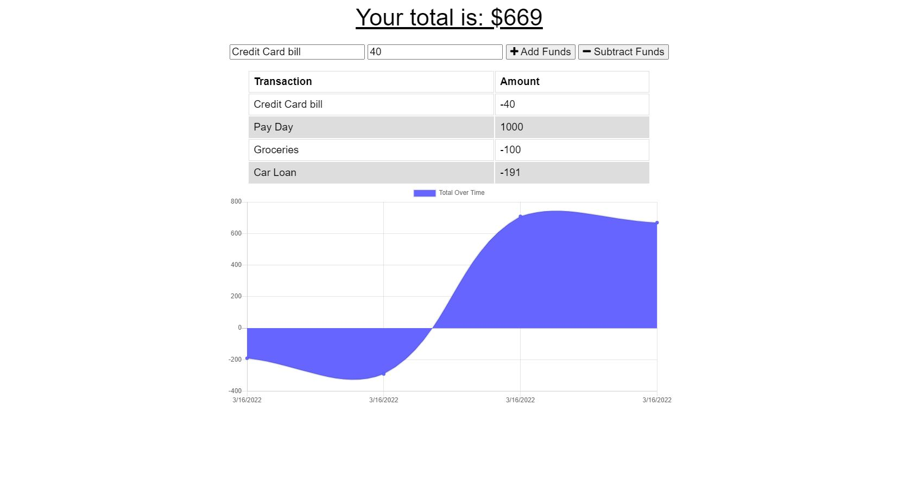

# Budget Tracker

## Table Of Contents
* [Description](#description)
* [Deployed Application](#deployed-application)
* [Screenshot of App](#screenshot)
* [User Story](#user-story)
* [Accpetance Criteria](#acceptance-criteria)

## Description
* This application allows users to track their money information without internet. User adds or subtract funds and a graph will show overtime.

## Deployed Application
* You can view the application [here](https://sheltered-river-58439.herokuapp.com/)

## Screenshot

## User Story
* AS AN avid traveler
* I WANT to be able to track my withdrawals and deposits with or without a data/internet connection
* SO THAT my account balance is accurate when I am traveling 

## Acceptance Criteria
* GIVEN a budget tracker without an internet connection
* WHEN the user inputs an expense or deposit
* THEN they will receive a notification that they have added an expense or deposit
* WHEN the user reestablishes an internet connection
* THEN the deposits or expenses added while they were offline are added to their transaction history and their totals are updated
